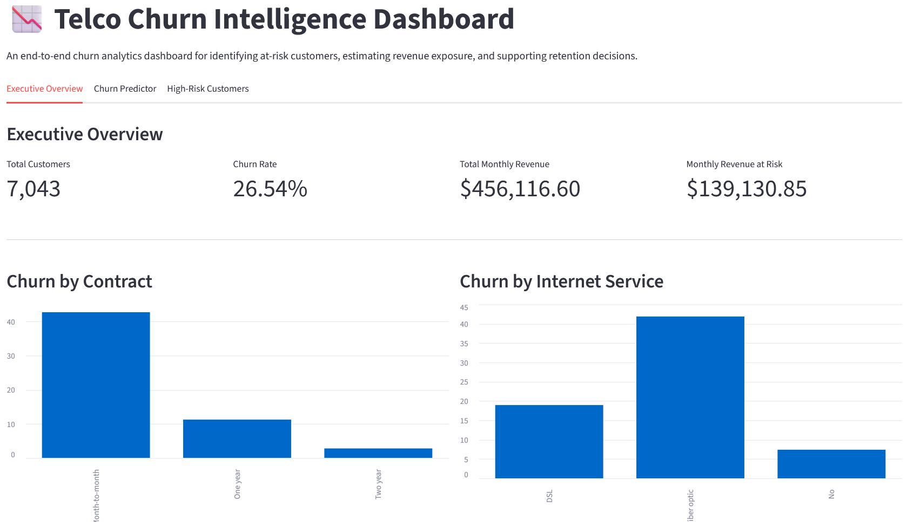
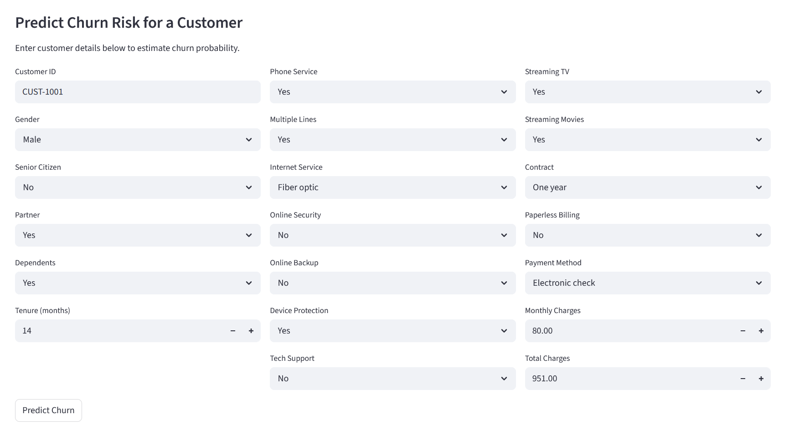
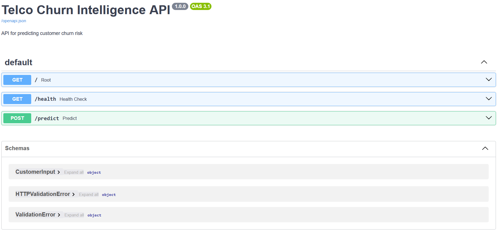

# 📉 Telco Churn Intelligence

An end-to-end analytics and machine learning project designed to **predict customer churn, quantify revenue at risk, and simulate retention strategies**.

This project goes beyond prediction by translating model outputs into **business decisions**, enabling targeted customer retention and improved revenue outcomes.

---

## 🚀 Executive Summary

Customer churn is a critical challenge for telecom companies, directly impacting revenue and growth.

In this project:

* Built a predictive model to identify customers likely to churn
* Achieved **ROC-AUC of 0.846** using Logistic Regression
* Identified key churn drivers such as contract type, tenure, and service usage
* Simulated a targeted retention strategy to estimate **revenue recovery and ROI**

---

## 🧠 Business Problem

Telecom companies lose significant revenue due to customer churn.

Key questions addressed:

* Who is most likely to churn?
* Why are they churning?
* How much revenue is at risk?
* Which customers should be targeted first?
* What is the expected ROI of retention campaigns?

---

## 📊 Dataset Overview

* Source: Telco Customer Churn dataset
* Records: ~7,000 customers
* Features: 20+ customer attributes including:

  * Demographics (gender, senior status)
  * Services (internet, security, support)
  * Account info (contract, tenure, billing)
  * Financials (monthly & total charges)

---

## 🔍 Key Insights

### 1. Contract Type Drives Churn

* Month-to-month customers have significantly higher churn
* Long-term contracts reduce churn risk

### 2. Customer Lifecycle Matters

* New customers (low tenure) are most likely to churn
* Long-tenure customers are more stable

### 3. Service Engagement Reduces Churn

* Customers without **OnlineSecurity** or **TechSupport** churn more
* Service bundles increase customer stickiness

### 4. Payment Behavior Signals Risk

* Electronic check users show higher churn rates
* Indicates possible friction or low engagement

---

## 🤖 Model Development

### Models Trained

* Logistic Regression ✅ (Best)
* Random Forest

### Evaluation Metric

* ROC-AUC (handles class imbalance better than accuracy)

### Results

| Model               | ROC-AUC    |
| ------------------- | ---------- |
| Logistic Regression | **0.8461** |
| Random Forest       | 0.8213     |

### Why Logistic Regression Won

* Better generalization on test data
* Simpler and more interpretable
* Indicates structured churn patterns

---

## 🔎 Model Explainability

Using logistic regression coefficients, the strongest churn drivers were:

### 📈 Increased Churn Risk

* Month-to-month contracts
* Electronic check payment method
* Lack of online security or tech support
* High monthly charges
* Short tenure (new customers)

### 📉 Reduced Churn Risk

* Two-year contracts
* Long tenure
* Service bundles (protection/support)
* Stable payment methods

---

## 💼 Business Simulation (Decision Layer)

The model was extended into a **retention strategy simulation**.

### Assumptions

* Target: High-risk customers only
* Cost per intervention: $20
* Success rate: 25%
* Retention value: 3 months of revenue

### Outputs

* Identified high-risk customer segments
* Estimated **monthly revenue at risk**
* Simulated **retained revenue**
* Calculated **ROI of retention campaign**

### Key Insight

Not all churners are equal — combining:

* **Churn probability**
* **Customer value**

leads to smarter prioritization.

---

## 🧱 Project Architecture

```text
telco-churn-intelligence/
├─ data/
├─ notebooks/
├─ src/
│  ├─ data_prep.py
│  ├─ features.py
│  ├─ train.py
│  ├─ evaluate.py
│  ├─ explain.py
│  └─ inference.py
├─ models/
├─ reports/
├─ api/
├─ app/
└─ README.md
```

---

## ⚙️ API (FastAPI)

The project includes a production-style API for real-time predictions.

### Run API

```bash
uvicorn api.main:app --reload
```

### Endpoints

* `/` → API status
* `/health` → health check
* `/predict` → predict churn

### Example Request

```json
{
  "tenure": 5,
  "Contract": "Month-to-month",
  "PaymentMethod": "Electronic check",
  "MonthlyCharges": 89.5,
  ...
}
```

### Example Response

```json
{
  "churn_probability": 0.81,
  "predicted_label": "Yes",
  "risk_tier": "High"
}
```

---

## 📊 Dashboard (Streamlit)

Interactive dashboard for:

* Executive overview
* Churn prediction
* High-risk customer analysis

### Run Dashboard

```bash
streamlit run app/dashboard.py
```

---

## 🖼️ Screenshots

### 📊 Dashboard Overview


### 🔮 Churn Prediction Interface


### ⚡ API Documentation (FastAPI)


---

## 🛠️ Tech Stack

* Python
* Pandas, NumPy
* Scikit-learn
* Matplotlib, Seaborn
* FastAPI
* Streamlit
* Joblib

---

## ▶️ How to Run Locally

```bash
# install dependencies
pip install -r requirements.txt

# run API
uvicorn api.main:app --reload

# run dashboard
streamlit run app/dashboard.py
```

---

## 🚀 Future Improvements

* Add XGBoost / LightGBM tuning
* Deploy API to cloud (Render / AWS)
* Add authentication layer to API
* Improve dashboard UX with filters & drilldowns
* Add automated data pipeline

---

## 💡 Key Takeaway

This project demonstrates how to move from:

> **Raw data → Model → Business decision → ROI estimation**

It shows not just technical ability, but the ability to **translate data into actionable business outcomes**.

---

## 👤 Author

**Daniel Diala**
Data Analyst | IT Support Specialist transitioning into Data & Analytics Engineering
